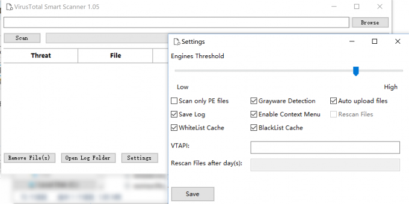

# Virus Total Smart Scanner

Virus Total Smart Scanner is a tool that can perform file scanning on any given directories. It has basic scan features and implementations, such as file type identification, rule match, cache management, and a clean user interface. 

The scan verdict, whether files are malicious or not, is based on the detections come from several trusted vendors on Virus Total. It can be integrated to context menu to perform a right-click scan or manually file inspection that opens Virus Total page based on file hashes.

## Special Notes

Virus Total Smart Scanner is my high school experimental project in 2018. It was first published in [Kafan Security Forum](https://bbs.kafan.cn/thread-2133049-1-1.html). That was almost three years ago, and I decide to make it open source. 

The project is not structured well, but functionality is ok. It is intended to show how easy an anti-virus scanner can be made by stealing the famous vendors' detections on Virus Total, naming "cloud detection". Many lazy and irresponsible vendors choose this method to make their detection rate looks "awesome", while potentially damages the whole anti-virus community by creating large amounts of unreliable detections and false-positives. 

## Highlighted Features

- High detection rate, low false positives: By only obtaining the identification results of discreet manufacturers, reduce false positives, avoiding you to see a bunch of strange and unintelligible names for poisoning.
- Accurate classification, let you know this threat type.
- Right-click menu integration, you can scan the folder you need to scan with one click, saving time and effort.
- Automatically recognize PE files, saving scanning time.
- Optional: automatic upload of unknown files.
- You can choose to turn on/off PUA detection.
- Customizable multi-engine reporting threshold.

## List of Trusted Vendors

`Kaspersky`
`ESET-NOD32`
`Malwarebytes`
`Microsoft`

## List of Detection Names

| Detection              |
|------------------------|
| Grayware.Unwanted      |
| Grayware.RiskTool      |
| Grayware.CoinMiner     |
| Phishing.Generic       |
| Exploit.Generic        |
| Worm.Generic           |
| Ransom.Generic         |
| Rootkit.Generic        |
| Backdoor.Bot           |
| Backdoor.Generic       |
| Trojan.Banker          |
| Trojan.Spy             |
| Trojan.Downloader      |
| Trojan.PasswordStealer |
| Trojan.Dropper         |
| Trojan.Script          |
| Trojan.Injector        |
| Trojan.Generic         |
| Malware.Confidence%    |

## Usage

Download and extract the zip file. Run `VTScanner.exe`.

## Troubleshoot

- If you encounter prompts such as "Getting Report Fails" or "Upload Fails" during the scanning process, please check your network connection; if necessary, please prepare your own proxy server.
- If you are stuck in a scanning process for a long time, it may be because the number of API requests has reached the limit (VTAPI limit is 4 times/minute), please wait.
- The software has built-in APIs, but it is still recommended that you fill in your own API (register on the VT official website->Settings->APIkey to get an API for free).
- The log is stored in the program directory\log folder, and there is a button on the main interface to open it directly.
- After uploading unknown files, you need to wait for the VT cloud to complete, this process is slow, please wait.

## Contributing

I am not going to develop this project anymore. You are welcome to folk and develop by your own.

## License 

See the [LICENSE](LICENSE) file for license rights and limitations (MIT).
